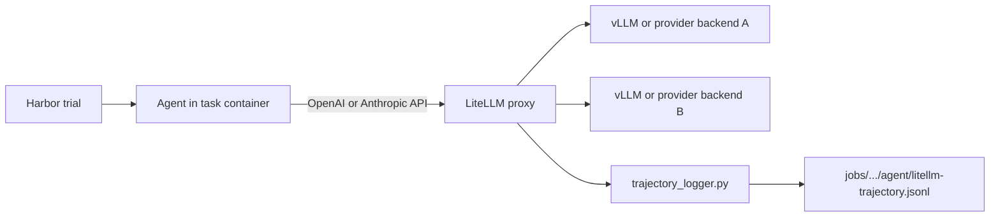

# High-Fidelity Agent Trajectories and Local Inference

This fork preserves two complementary views of an agent run:

- the agent's native messages, events, tool calls, and tool results in its
  original output format; and
- provider-normalized model requests and responses recorded per call by
  LiteLLM in an OpenAI-compatible schema, together with timing, token usage,
  and structured failure information.

Keeping both views retains agent-specific behavior while making model traffic
comparable across different agents. These per-trial records provide auditable
source data for SFT dataset preparation, trajectory-quality analysis, failure
attribution, and runtime profiling. Review and sanitize trajectories before
using them for training because prompts, tool output, and model responses may
contain task data or secrets supplied at runtime.

The `scripts/serve_llm/` tools capture the model-call view and provide a local
inference path for Harbor:



The proxy normalizes provider protocols, records model calls, and can keep all
turns from one task on the same backend to improve KV-cache locality.

## Start LiteLLM

Create a dedicated environment and copy an example configuration:

```bash
conda create -n harbor-litellm python=3.13
conda activate harbor-litellm
pip install "litellm[proxy]==1.83.9"

cp scripts/serve_llm/litellm_config.example.yaml \
  scripts/serve_llm/litellm_config.yaml
```

Edit the local configuration with your own upstream endpoint and credential.
Tracked example files contain placeholders; untracked local configurations may
contain secrets and must not be committed.

Generate a dedicated proxy master key and start the proxy:

```bash
export LITELLM_MASTER_KEY="$(openssl rand -hex 32)"
bash scripts/serve_llm/serve_litellm.sh
```

The launcher refuses missing and known example keys. It binds to `0.0.0.0` by
default so task containers can reach it; restrict the host firewall or set
`HOST=127.0.0.1` when container access is not required. Never expose the proxy
port directly to an untrusted network.

Useful overrides include:

```bash
LITELLM_PORT=4002 \
LITELLM_NUM_WORKERS=4 \
LITELLM_LOG_LEVEL=INFO \
  bash scripts/serve_llm/serve_litellm.sh
```

The default worker count avoids making one proxy worker a bottleneck during
long-prompt, high-concurrency evaluations. Use `DEBUG` logging only for small
diagnostic runs because request serialization can produce substantial output.

## Health Checks

Use the same master key exported when the proxy was started:

```bash
curl -H "Authorization: Bearer ${LITELLM_MASTER_KEY}" \
  http://127.0.0.1:4001/health/readiness

curl -H "Authorization: Bearer ${LITELLM_MASTER_KEY}" \
  http://127.0.0.1:4001/v1/models
```

Use `/health/readiness` and `/v1/models` to verify the proxy itself before
debugging upstream model calls.

## OpenAI-Compatible and Anthropic-Compatible Upstreams

| Example | Local copy | Upstream protocol | Base URL convention |
| --- | --- | --- | --- |
| `litellm_config.example.yaml` | `litellm_config.yaml` | OpenAI-compatible | Usually ends in `/v1` |
| `litellm_config_anthropic.example.yaml` | `litellm_config_anthropic.yaml` | Anthropic-compatible | Usually does not end in `/v1` |

Use the Anthropic configuration when the upstream implements Anthropic
Messages directly. Otherwise LiteLLM can translate Anthropic client requests
to an OpenAI-compatible chat-completions backend.

## Sticky Task Routing

`trajectory_logger.py` derives a routing key in this order:

1. `x-litellm-routing-key`
2. `x-instance-id`
3. `x-trajectory-output-path`

When a Harbor trajectory path is used, the random trial suffix is removed so a
resumed task remains assigned to the same backend alias.

Configure aliases with:

```text
PUBLIC_MODEL=PUBLIC_MODEL@backend-a,PUBLIC_MODEL@backend-b
```

Set this string in `LITELLM_STICKY_ROUTING_ALIASES`. Each alias must also exist
in the LiteLLM configuration. An empty value disables sticky routing.

Transient failures such as connection errors, timeouts, `408`, `429`, and
`5xx` responses contribute to a worker-local cooldown. The default threshold
is two consecutive failures and the default cooldown is 300 seconds:

```bash
LITELLM_STICKY_ROUTING_FAILURE_THRESHOLD=2
LITELLM_STICKY_ROUTING_COOLDOWN_SECONDS=300
```

Cooldown is not a global health check. The alias automatically becomes eligible
again after the interval.

## Per-Trial Trajectories

For standard job directories, custom agents send a portable `job/trial` route
instead of a host filesystem path. The callback resolves it beneath
`TRAJECTORY_JOB_ROOT` (the repository `jobs/` directory by default) and writes
one JSON object per model call to:

```text
jobs/<job>/<trial>/agent/litellm-trajectory.jsonl
```

Records retain normalized request and response bodies alongside timestamps,
duration, token usage, and structured failure information. Obvious secret
fields in extra parameters and failure diagnostics are redacted, but prompt,
tool, and response content is intentionally retained and must still be treated
as sensitive. Together with each
agent's native trajectory in the same trial directory, this allows downstream
tools to reconstruct agent behavior without flattening away agent-specific
events. Legacy absolute paths are accepted only beneath `TRAJECTORY_JOB_ROOT`,
the fallback output directory, or roots explicitly listed in
`TRAJECTORY_ALLOWED_ROOTS` (separated by the platform path separator). Calls
without an explicit output route fall back to
`scripts/serve_llm/trajectories/default.jsonl`.

If only the fallback file grows, rebuild the mounted runtime: the runtime must
preserve the custom header when it calls LiteLLM.

## vLLM Helpers

The directory also includes model-specific vLLM launchers and
`serve_vllm_auto_resume.sh`. Model paths and machine-specific settings must be
provided through environment variables. The auto-resume helper waits for GPU
memory to be released before restarting a failed backend, but it is not a
replacement for external service monitoring.

## Diagnostic Order

1. Check `/health/readiness` and `/v1/models`.
2. Inspect `scripts/serve_llm/litellm_log/`.
3. Inspect the trial's `litellm-trajectory.jsonl`.
4. Confirm `ANTHROPIC_BASE_URL` or `LLM_BASE_URL` inside the task container.
5. Match structured failure deployment information to the configured backend.
